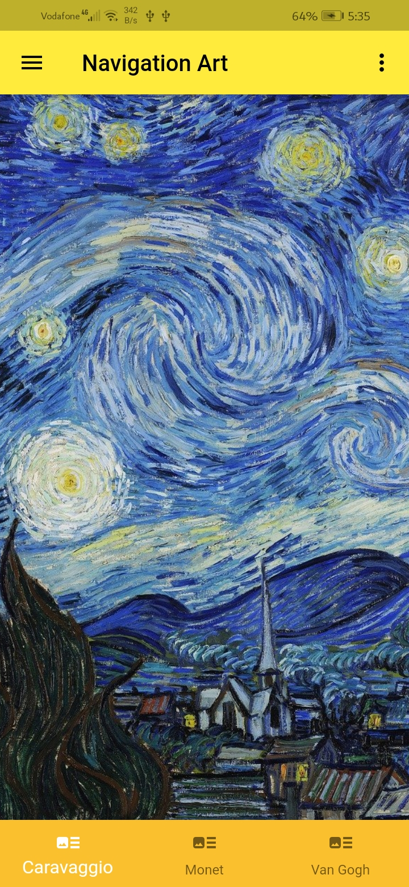
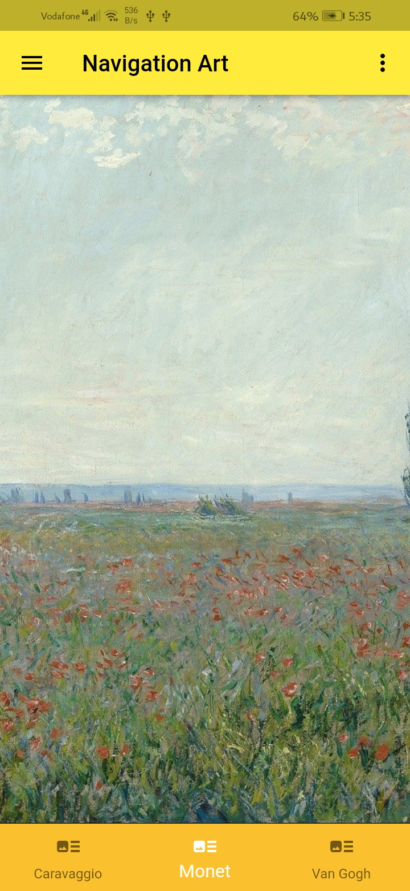
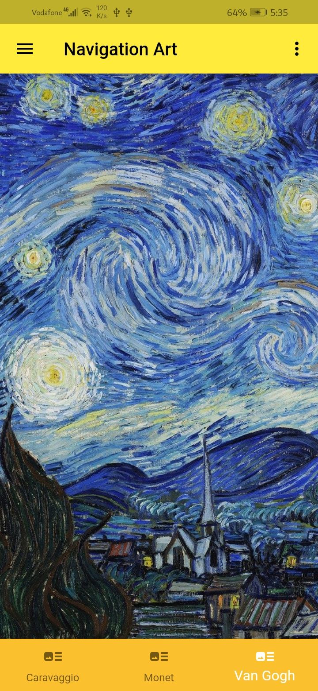
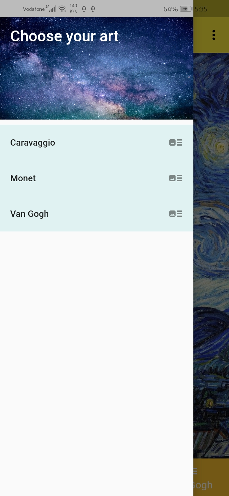
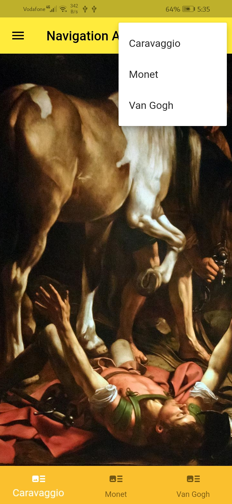
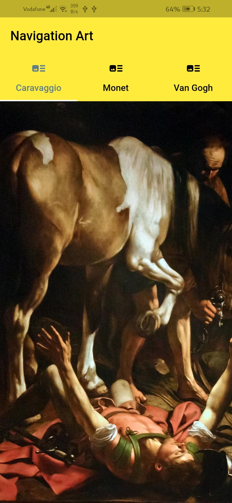
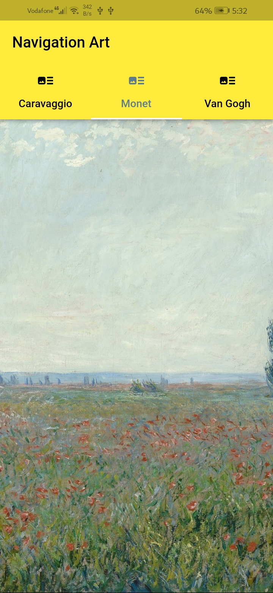
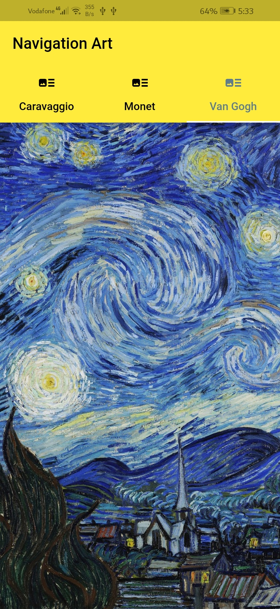

# Navigation

A new Flutter project. To use all ways to navigate between screens

# The different ways to navigate
## PopupMenuButton: 
    Is used in action at AppBar
PopupMenuButton(

    */ Choose between icon Or child parameters. But not both together!/*
    // icon: Icon(Icons.'AnyIcon'),
    child: Text('Any Text'),

    itemBuilder: (BuildContext context) => [
        PopupMenuItem(
            value: 1,
            child: Text('First),
        ),
    ],
    onSelected: (v) => doSomething(context, v),
    ),

## Drawer:
    Is a flexible way to add navigation to the Application
* Requires a Scaffold
* Add items with child. NOTE: it has a child not a children
* Use ListView or Column as a child
* Use DrawerHeader when appropriate 

## BottomNavigationBar:
    Is a Widget that displayed at the bottom of the screen
* Requires a Scaffold
* Used with several items usually for 3 to 5 items
* May contain text, icon or both

### inside a Scafolld

    bottomNavigationBar: BottomNavigationBar(   
        items: [
        // Use the items parameter to add BottomNavigationBarItem Widgets
            BottomNavigationBarItem(
                icon: Icon(Icons.'AnyIcon',),
                label: 'Title', // if not exists cause an error
            ),
        ],
        onTap: (value){ // Respond t user input with onTap
            // navigateToYourScreen();
        }
    ),

## TabBar:
    Is made from three parts
* TabBarController
* TabBar
* TabBarView

# But how to use between them
## by the number of items to show
    If is more than 4 or 5 items => choose one the vertical layouts

### Vertical Layouts
* PopupMenuButton 
* Drawer (it's more flexible so it's better)

### Horizontal Layouts
* BottomNavigationBar (it's more simple)
* TabBar (if you need animation on navigation it's perfect)

## Drawer & BottomNavBar & PopupMenuButton ScreenShots

  
  
  
   
   

## TabBar ScreenShots

  
  
  

